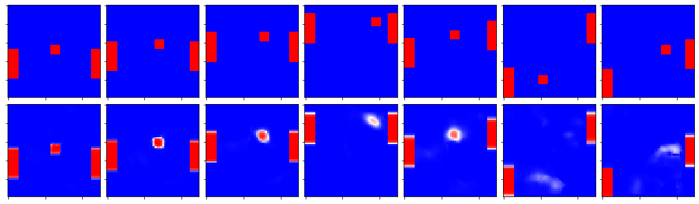

# Differentiable Simulation

Learning to simulate complex processes with neural networks.

---

This repo contains materials for my masters project on learning stateful simulations with deep differentiable models. The focus will be to train a neural network to be an end-to-end game.

## Setup

The abstraction for a simulation I will look at is as follows:

- black box that has a state
  - the state can be initialized with some parameters
- every tick the black box takes input
- changes the state based on the input
- and produces an output, in the case of the game this would be the rendered frame of the game at that time

Classic `init() -> while(true) { update() }` setup.

This fits really well with the shape of the data that RNNs are designed to model so this would naturally be my first experiment to try.

Concretely the game I am going to attempt to model is PONG. This game can be described with a small state and simple rules. The task of the model would be to learn to manage the state of the game. To learn how to update it, based on the input, and how to use it to render every frame of the game.
I recon it will be interesting to analyze how different parts of the state influence the output.

## Ideas for research

- [DilatedRNN](https://github.com/code-terminator/DilatedRNN)
  - Let high level RNN cells observe only parts of the sequence (e.g. only every second output of the RNN below it).
  - Idea being that these cells will hold long term state that is updated less frequently.
  - It will be easier for the gradient from the front to propagate to the back since the higher level sequences will be shorter.
  - This might be beneficial in the case of the vanishing gradient problem.
- Progressive sequence growth
  - Start with short sequences and increase the length in the process of learning.
  - Hypothesis is that this might speed up training for longer sequences.
  - Similar to the idea of ProGAN.
- Internally stacked RNN
  - Statet = DNN(inputt, statet-1)
  - Might play well with the diluted RNN.
- Runtime feature detectors
  - Train two networks, the first one learns to predict the detectors of the second. Both of the networks are ran on the same input. The idea is that We would have input specific feature detectors.
  - Polynomial type of interaction of the input with the network?
  - This idea could be beneficial in the case of the Learned GameEngine - generating (simulation) network based on the embedding of the simulation (the game).
- Learning vector representations of games
  - Two neural network
    - The first one learns to predict the weights of the second one based on fixed length representation of a game.
    - The second one, being a recurrent model simulates the game.
    - This can all be made differentiable and trained end-to-end.
  - We can think of the first network being the game engine. The game embedding as being the description of a game on that game engine and the second neural network as implementation of the game itself.
  - This idea is too far-fetched and might net be feasible to be done.
  - The main focus here will be to try to make the `Runtime feature detectors` work.
  - If this turns out successful it will be interesting to try to understand how the game is encoded in the latent space of its embedding vector.
  - It will be interesting to experiment with algebraic operations in this space.
    - Taking the average of two games.

## Examples of progress so far

not much but it's honest work

- Split screen view of the true and the predicted state of the simulation.
  
- Up - True frame, Down - Predicted frame
  

## TODOs

- Research OpenAI gyms [here](https://gym.openai.com/envs/Pong-v0/)

## Resources

- Articles/Papers

  - [World Models](https://worldmodels.github.io)
  - [Neural Turing Machines](https://arxiv.org/abs/1410.5401)
  - [End-To-End Memory Networks](http://papers.nips.cc/paper/5846-end-to-end-memorynetworks)
  - [Memory Networks](https://arxiv.org/abs/1410.3916)
  - [Differentiable neural computer](https://en.wikipedia.org/wiki/Differentiable_neural_computer)
  - [Differentiable neural computers (DeepMind)](https://deepmind.com/blog/article/differentiable-neural-computers)

  - VAE Research
    - [KL Divergence: Forward vs Reverse?](https://wiseodd.github.io/techblog/2016/12/21/forward-reverse-kl/)
    - [Mixture density VAE for composing (Masters thesis)](https://www.duo.uio.no/bitstream/handle/10852/67479/1/Variational_Autoencoders_for_Algorithmic_Composition.pdf)

- Videos

  - [Neural Network Learns The Physics of Fluids and Smoke | Two Minute Papers #118](https://www.youtube.com/watch?v=iOWamCtnwTc)
  - [Building Machines that Learn & Think Like People - Prof. Josh Tenenbaum ICML2018](https://www.youtube.com/watch?v=RB78vRUO6X8)
  - [Symposium: Deep Learning - Alex Graves](https://www.youtube.com/watch?v=_H0i0IhEO2g)
  - [Neural Turing Machines](https://www.youtube.com/watch?v=Ensr41dfEp0)
  - [RNN Symposium 2016: Alex Graves - Differentiable Neural Computer](https://www.youtube.com/watch?v=steioHoiEms)
